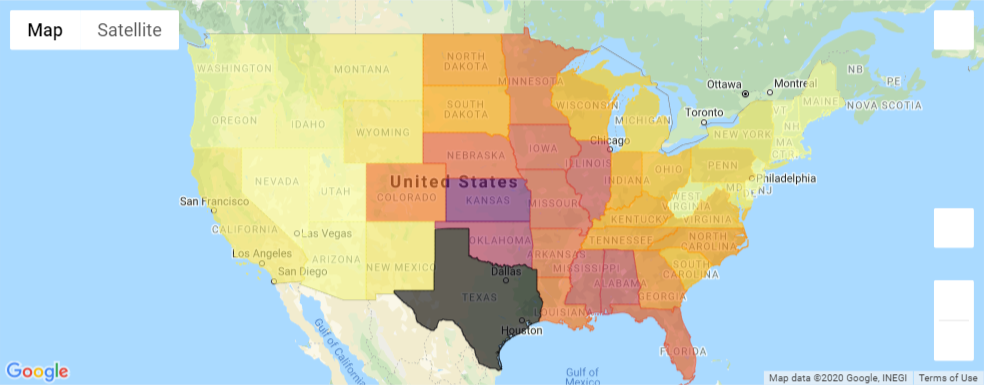
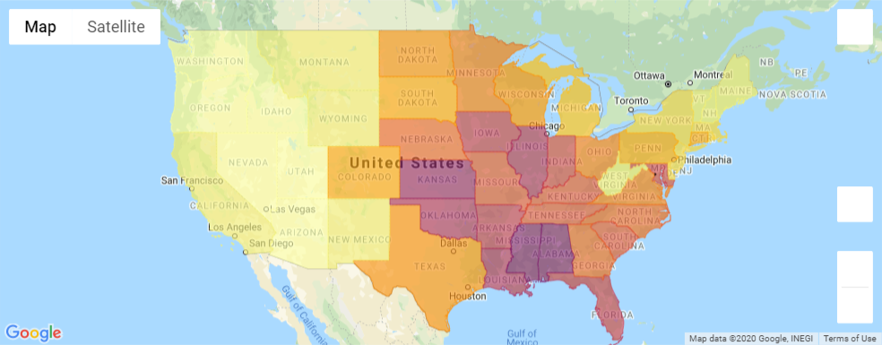
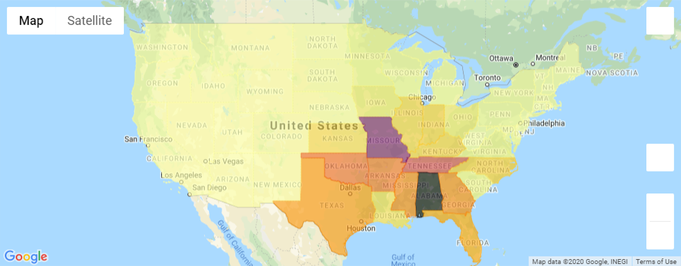
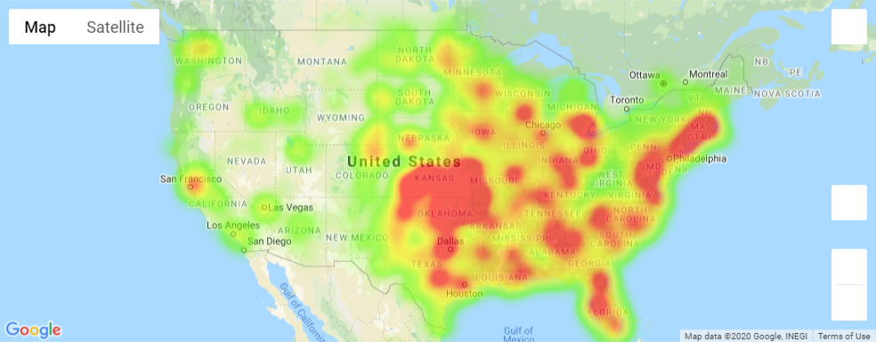
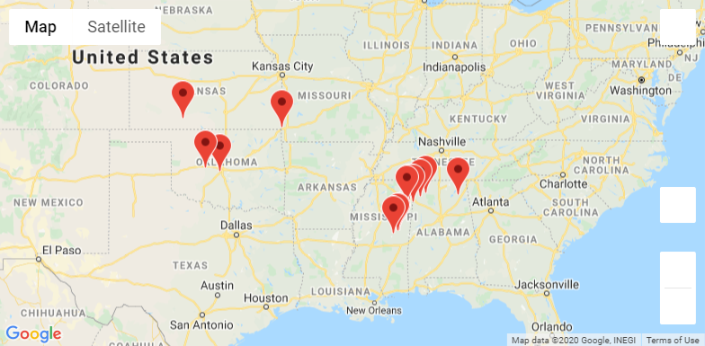

# Tornado Impact - Data Analysis

<u>**Presentation**</u> can be found on this [link](https://docs.google.com/presentation/d/1u8G5r97uOqN3bWcc0y8v9-K7BwnoQTqcsovgodx5tXQ/edit?usp=sharing).

### Objective

We are all interested in weather data, but more specifically interested in the tornado events that occur both locally and nationally.  Our project is to look at the geographic distribution of tornado events in the United States, with focus on the various “measurements of impact”, from the loss of life to the financial ramifications, and explore how the geographic distribution and measurements of impact for Indiana measure up against the national results.

This was a team project and I authored the notebook  *Tornado Impact - Data Exploration and Cleanup.ipynb*. In the notebook *Tornado Impact - Data Analysis.ipynb* I wrote all first chapters before "EF and F Scale Analysis".

#### Data Exploration and Cleanup

In this research we are using publicly available [NCEI Storm Events Database](https://www.ncdc.noaa.gov/stormevents/ftp.jsp). It contains various types of storms from January 1950 to December 2019, entered by NOAA's National Weather Service (NWS). Data are available in comma-separated value (CSV) files, three files per year: "details", "locations" and "fatalities".

In our research we will be using only "details" files from 1996 to 2019.

We kept only data for tornado events and reduced the number of features from 51 to 11. The cleanup process is described in detail in the notebook *Tornado Impact - Data Exploration and Cleanup.ipynb*. The output file was save in the csv format: *Outputs/Tornado_heatmap_cities.csv*.

#### Data Analysis

This phase is described in the notebook *Tornado Impact - Data Analysis.ipynb*.

To see the maps in the notebook you will need to rerun the notebook, so I will display all maps in this README.

##### Annual Average of Tornadoes per State (1996 - 2019)

##### Annual Average of Tornadoes per 10K sq mi per State (1996 - 2019)

##### Total Tornado Fatalities per State (1996 - 2019)

##### Tornado Heatmap for Total Count (1996 - 2019)

##### Most Common F/EF5 Locations

### Tools / Techniques Used:

- Python

- Pandas

- Matplotlib

- Jupyter Notebook

- Choropleth maps with GeoJSON

- numpy

- gmaps

- citipy

- cpi

  

### About Data

As we mentioned earlier, we are using only "details" files from 1996 to 2019 from [NCEI Storm Events Database](https://www.ncdc.noaa.gov/stormevents/ftp.jsp). 

The file *Storm-Data-Export-Format.pdf* contains detailed information about all feature in these files.

Due to size limits, 24 input files are zipped to 5 files.

1. ***<u>Outputs/Tornadoheatmapcities.csv</u>*** - an output from the cleanup stage and an input to data analysis

- **Number of records:**      33,006

- **Columns**:

  - EVENT_ID
  - STATE
  - YEAR
  - MONTH_NAME
  - BEGIN_DATE_TIME
  - TOR_F_SCALE
  - BEGIN_LAT
  - BEGIN_LON
  - INJURIES
  - DEATHS
  - DAMAGE

  
  
  #### Team Members:
  
  - Damir Zunic ([zunicd@yahoo.com](mailto:zunicd@yahoo.com)):
    - notebook  *Tornado Impact - Data Exploration and Cleanup.ipynb*
    - notebook *Tornado Impact - Data Analysis.ipynb*:
      - Introduction
      - Choropleth maps with GeoJSON
      - Additional insights from Tornado Data
  - Andrea Johnson ([asjohnson099@gmail.com](mailto:asjohnson099@gmail.com)):
    - notebook *Tornado Impact - Data Analysis.ipynb*:
      - Damage Stats and FEMA Data
  - Lindsey Downs (ldowns@butler.edu):
    - notebook *Tornado Impact - Data Analysis.ipynb*:
      - EF and F Scale Analysis

